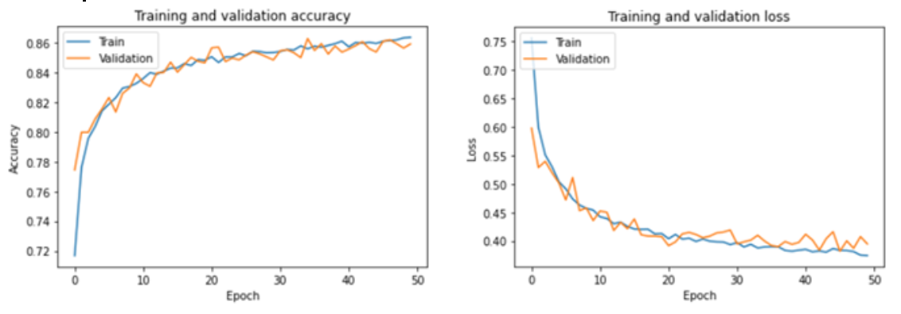
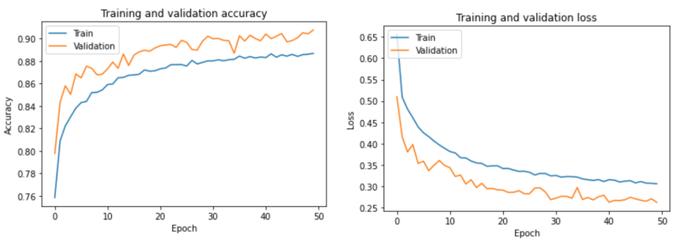
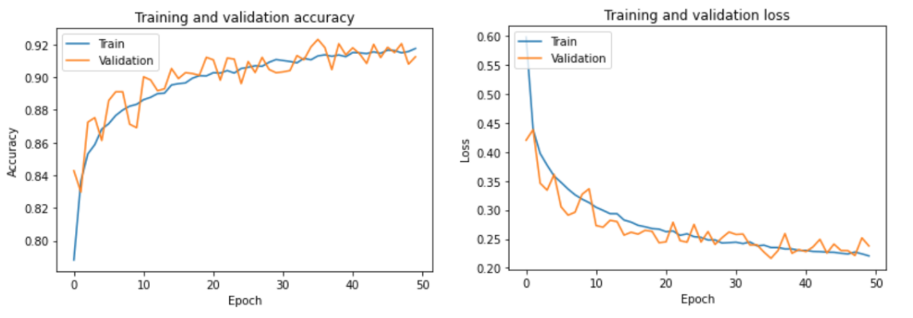
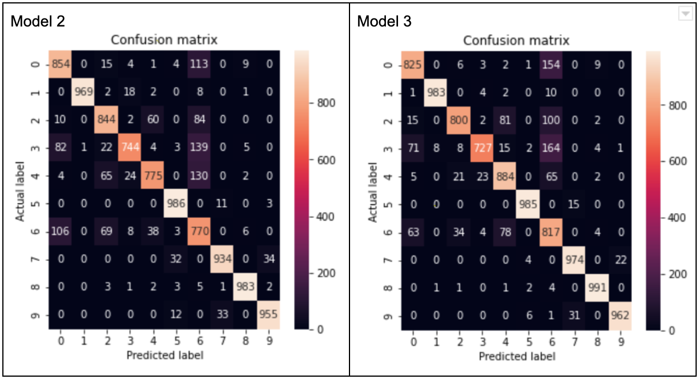
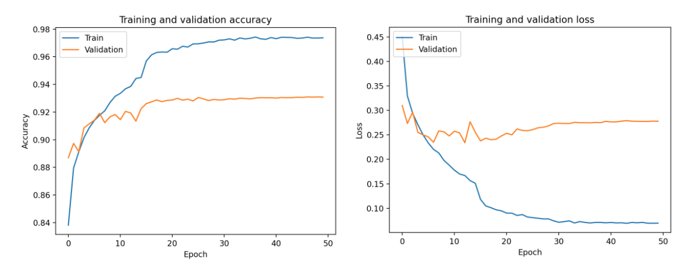

# CNN

## How to load models
```
from keras import models

model1 = models.load_model('./model/cnn_model_1.h5')
model2 = models.load_model('./model/cnn_model_2.h5')
model3 = models.load_model('./model/cnn_model_3.h5')
```

## How to load weights
```
import numpy as np

weights1 = np.load('./weights/weights_model_1.npy', allow_pickle=True)
weights2 = np.load('./weights/weights_model_2.npy', allow_pickle=True)
weights3 = np.load('./weights/weights_model_3.npy', allow_pickle=True)
```

## Data Augmentation

### Model 1
<p float="left">
  
</p>

### Model 2
<p float="left">
  
</p>

### Model 3
<p float="left">
  
</p>

## Confusion Matrix

Model 1 is already shown in the report.
<p float="left">
  
</p>

## Dynamically Decreasing Learning Rate

Model 2 with updated Learning Rate: Train / Validation / Test top-1 accuracy table

|                         | Train (train dataset) | Validation (validation dataset) | Test (test dataset) |
|-------------------------|-----------------------|---------------------------------|---------------------|
| Model 2 with updated LR | 97.37%                | 93.08%                          | 92.86%              |


Model 2 with updated Learning Rate: Train and validation accuracy and loss graphs
<p float="left">
  
</p>

## Architecture of models

### Model 1
```
_________________________________________________________________
Layer (type)                 Output Shape              Param #   
=================================================================
flatten_1 (Flatten)          (None, 784)               0         
_________________________________________________________________
dense_1 (Dense)              (None, 1028)              806980    
_________________________________________________________________
dense_2 (Dense)              (None, 512)               526848    
_________________________________________________________________
dense_3 (Dense)              (None, 256)               131328    
_________________________________________________________________
dense_4 (Dense)              (None, 128)               32896     
_________________________________________________________________
dropout_1 (Dropout)          (None, 128)               0         
_________________________________________________________________
dense_5 (Dense)              (None, 10)                1290      
=================================================================
Total params: 1,499,342
Trainable params: 1,499,342
Non-trainable params: 0
```

### Model 2
```
_________________________________________________________________
Layer (type)                 Output Shape              Param #   
=================================================================
conv2d_1 (Conv2D)            (None, 26, 26, 32)        320       
_________________________________________________________________
max_pooling2d_1 (MaxPooling2 (None, 13, 13, 32)        0         
_________________________________________________________________
batch_normalization_1 (Batch (None, 13, 13, 32)        128       
_________________________________________________________________
flatten_1 (Flatten)          (None, 5408)              0         
_________________________________________________________________
dropout_1 (Dropout)          (None, 5408)              0         
_________________________________________________________________
dense_1 (Dense)              (None, 512)               2769408   
_________________________________________________________________
dropout_2 (Dropout)          (None, 512)               0         
_________________________________________________________________
dense_2 (Dense)              (None, 128)               65664     
_________________________________________________________________
dropout_3 (Dropout)          (None, 128)               0         
_________________________________________________________________
dense_3 (Dense)              (None, 10)                1290      
=================================================================
Total params: 2,836,810
Trainable params: 2,836,746
Non-trainable params: 64
```

### Model 3
```
_________________________________________________________________
Layer (type)                 Output Shape              Param #   
=================================================================
conv2d_1 (Conv2D)            (None, 26, 26, 32)        320       
_________________________________________________________________
max_pooling2d_1 (MaxPooling2 (None, 13, 13, 32)        0         
_________________________________________________________________
batch_normalization_1 (Batch (None, 13, 13, 32)        128       
_________________________________________________________________
conv2d_2 (Conv2D)            (None, 11, 11, 128)       36992     
_________________________________________________________________
max_pooling2d_2 (MaxPooling2 (None, 5, 5, 128)         0         
_________________________________________________________________
batch_normalization_2 (Batch (None, 5, 5, 128)         512       
_________________________________________________________________
flatten_1 (Flatten)          (None, 3200)              0         
_________________________________________________________________
dropout_1 (Dropout)          (None, 3200)              0         
_________________________________________________________________
dense_1 (Dense)              (None, 512)               1638912   
_________________________________________________________________
dense_2 (Dense)              (None, 10)                5130      
=================================================================
Total params: 1,681,994
Trainable params: 1,681,674
Non-trainable params: 320
```

## References
* https://keras.io/models/model/
* https://keras.io/models/sequential/
* https://keras.io/layers/core/
* https://keras.io/layers/convolutional/
* https://keras.io/optimizers/
* https://keras.io/losses/
* https://keras.io/callbacks/#learningratescheduler
* https://www.tensorflow.org/api_docs/python/tf/keras/preprocessing/image/ImageDataGenerator
* https://keras.io/layers/normalization/
* https://keras.io/getting-started/functional-api-guide/
* https://keras.io/layers/merge/