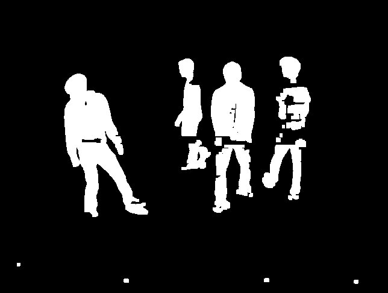
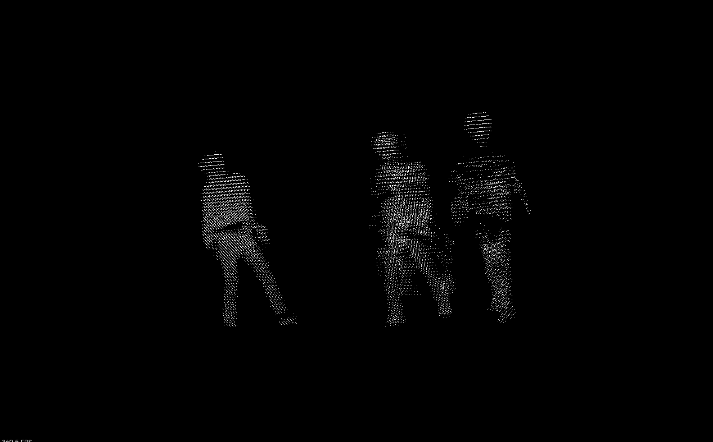
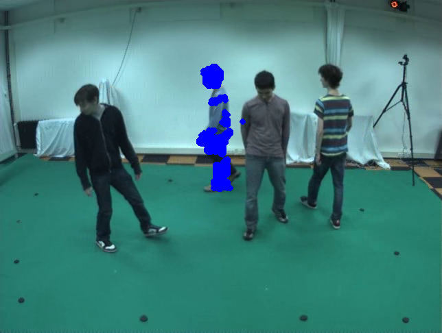

# Color Model

## Steps
1. Execute "background-subtraction", the computed foreground image "foreground.png" will be stored in each camera folder as output;
<p float="left">
  
</p>

2. Execute "voxel", the voxel's (x, y, z) will be stored in "voxel.xml" in "data" folder;
<p float="left">
  
</p>

3. Execute "k-means", the clusters and their corresponding centers will be stored in "cluster.xml" in "data" folder;

4. Execute "color-model" with one param 0, 1, 2, 3 to indicate cluster 1, 2, 3, 4 respectively, e.g. "./color-model 1". The aimed cluster will be projected onto the image plane in blue, which will be used later to build color model. 
<p float="left">
  
</p>

## Command to compile voxel.cpp
```
$ cmake .
$ make
```

## Command to compile the source code on Mac OS with OpenCV 4.2
```
$ g++ $(pkg-config --cflags --libs opencv4) -std=c++11 -o target-file-name source-file-name.cpp
```