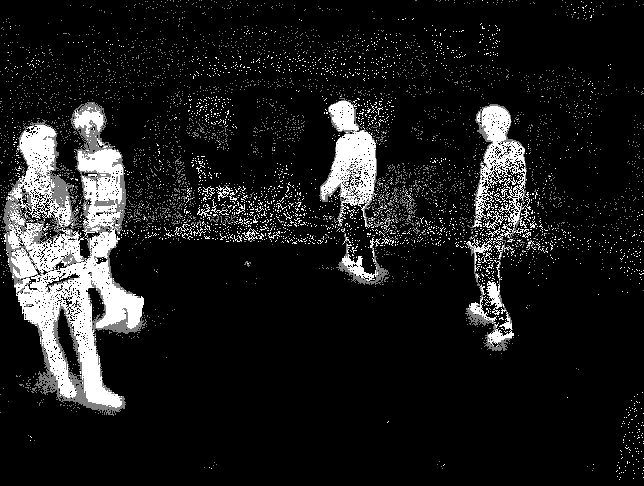
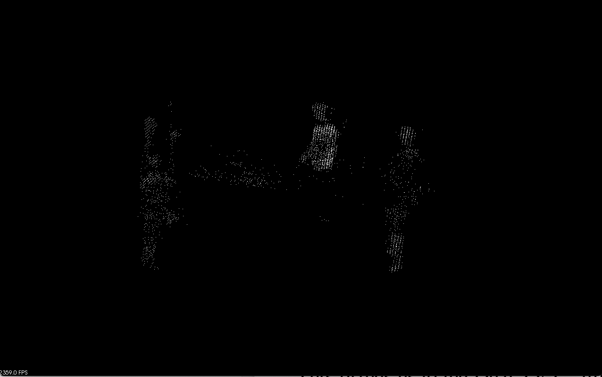
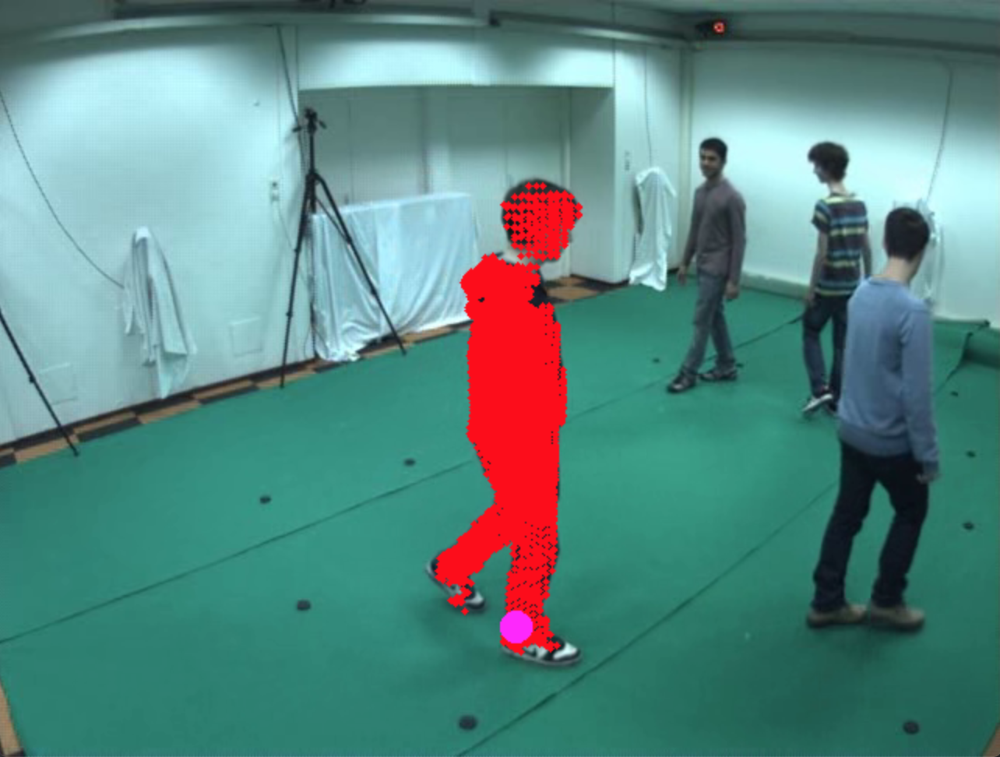
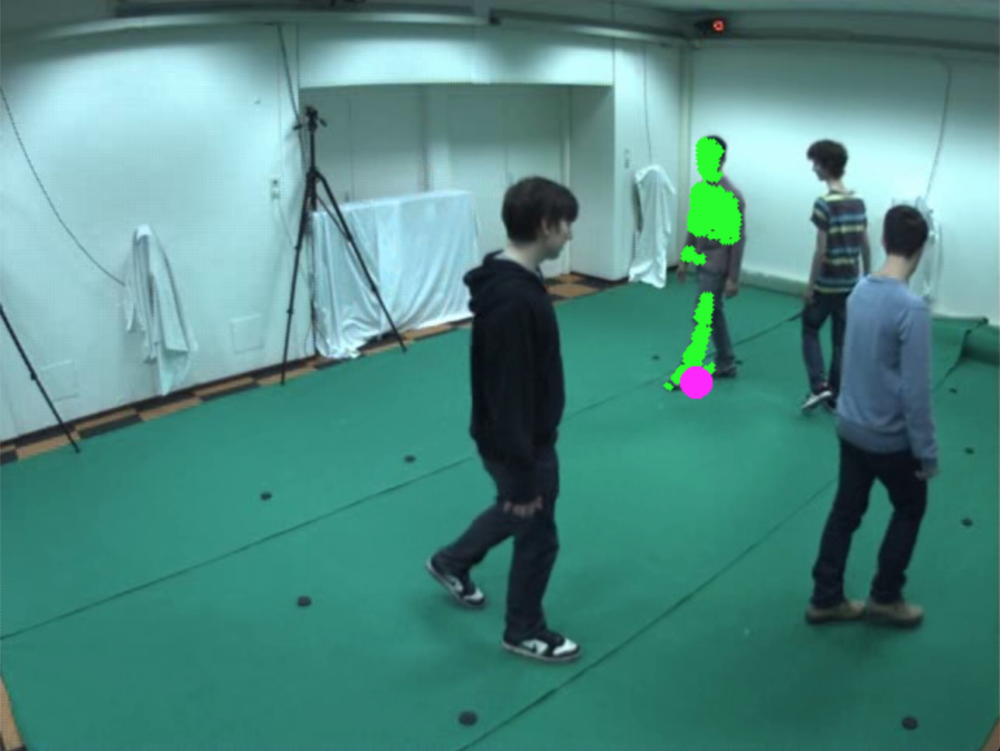
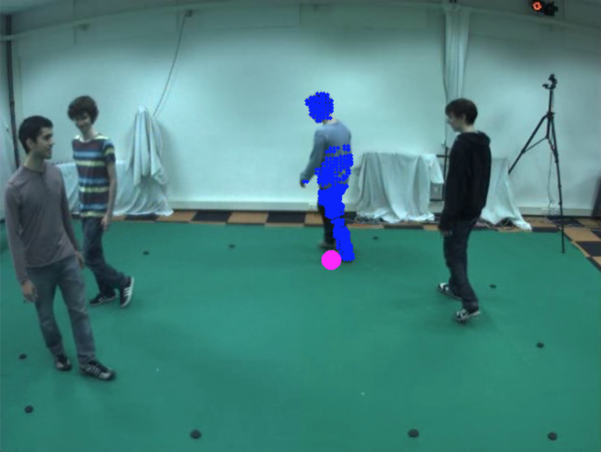
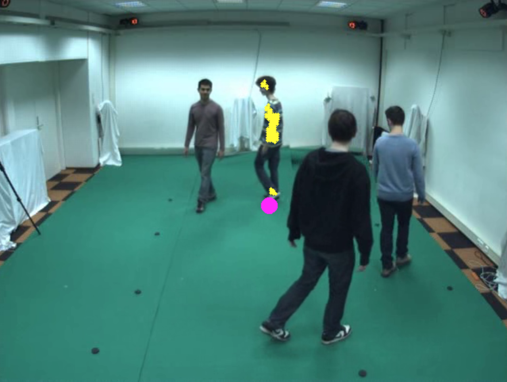

# Color Model

## Steps
1. Execute "background-subtraction", the computed foreground image "foreground.png" will be stored in each camera folder as output;
<p float="left">
  
</p>

2. Execute "voxel-reconstruction", the voxel's (x, y, z) will be stored in "voxel.xml" in "data/voxel" folder;
<p float="left">
  
</p>

3. Execute "k-means", the clusters and their corresponding centers will be stored in "cluster.xml" in "data/cluster" folder;

4. Execute "project-voxel" with the param "frameID" to indicate the chosen frame ID, e.g. "./project-voxel 1895". Four clusters will be projected onto cam1, cam2, cam3 and cam4 respectively. 
<p float="left">
  
  
</p>

<p float="left">
  
  
</p>

5. Execute "color-model", the color model will be trained online and used to predict each cluster's ID. The prediction results will be stored in "colored.xml" in "data/cluster" folder;

6. Execute "voxel-visualization", the colored voxels w.r.t each person will animate in 3D space.

## Command to compile voxel.cpp
```
$ cmake .
$ make
```

## Command to compile the source code on Mac OS with OpenCV 4.2
```
$ g++ $(pkg-config --cflags --libs opencv4) -std=c++11 -o target-file-name source-file-name.cpp
```