# Fundamentals

## Translation

  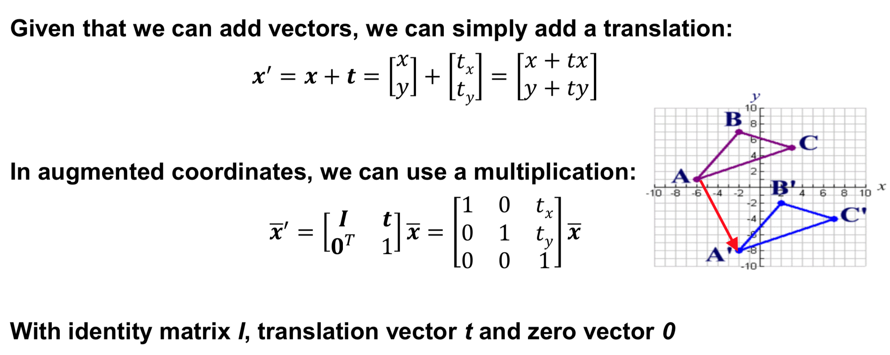

## Rotation

  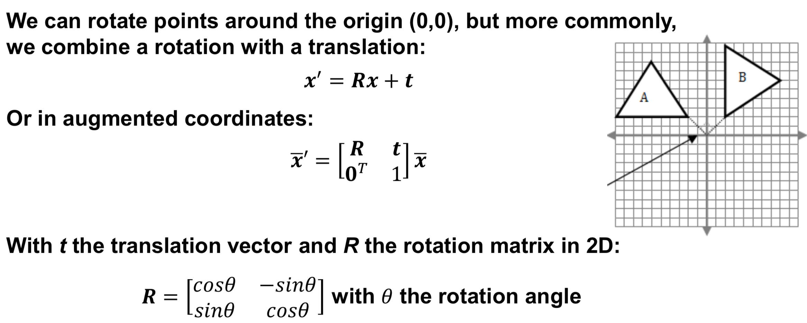

  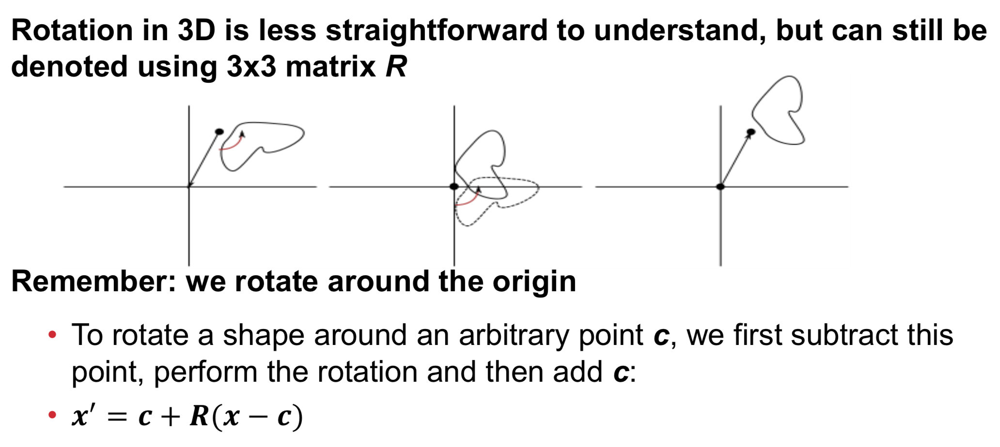

## Extrinsic Parameters

  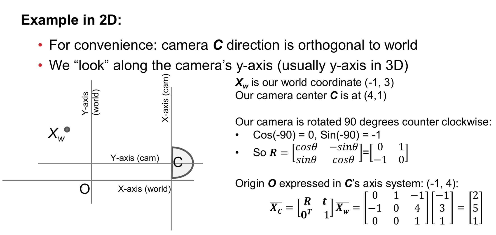

  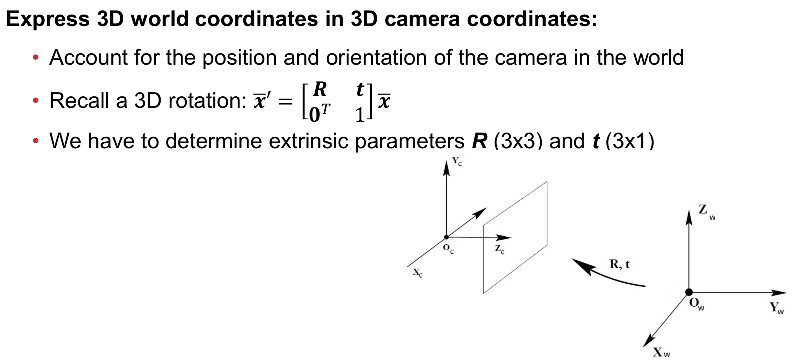

## Intrinsic Parameters

  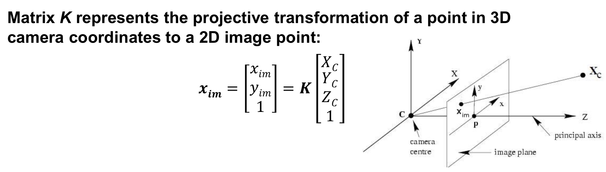

  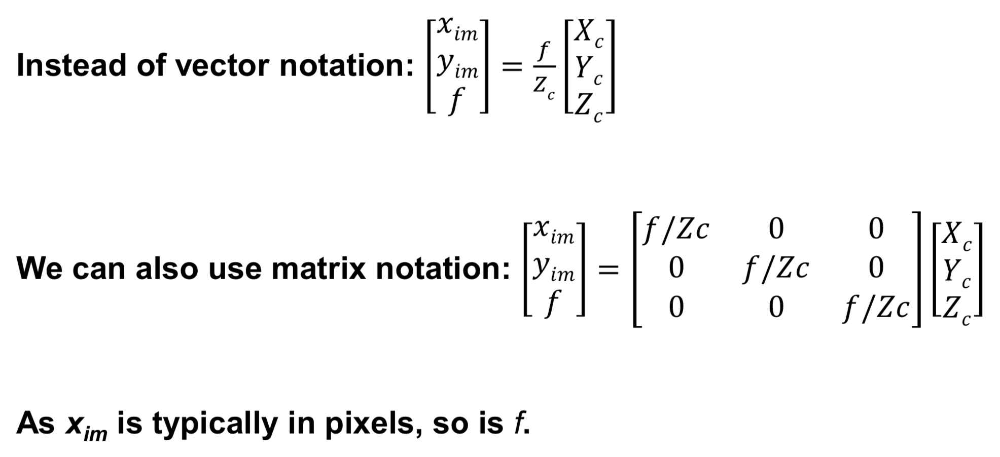

  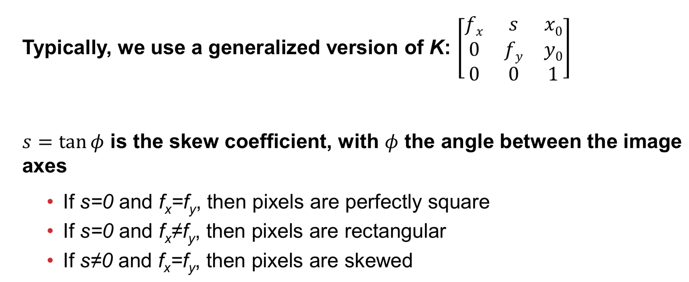

## Extrinsic & Intrinsic Parameters

  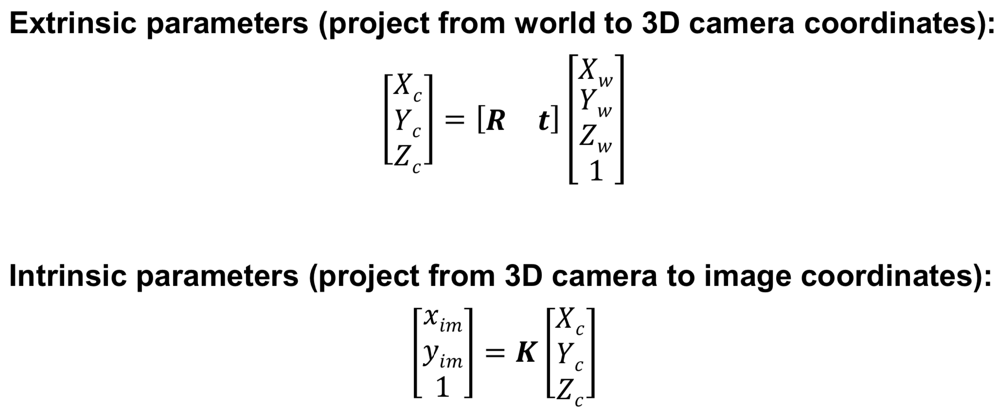

  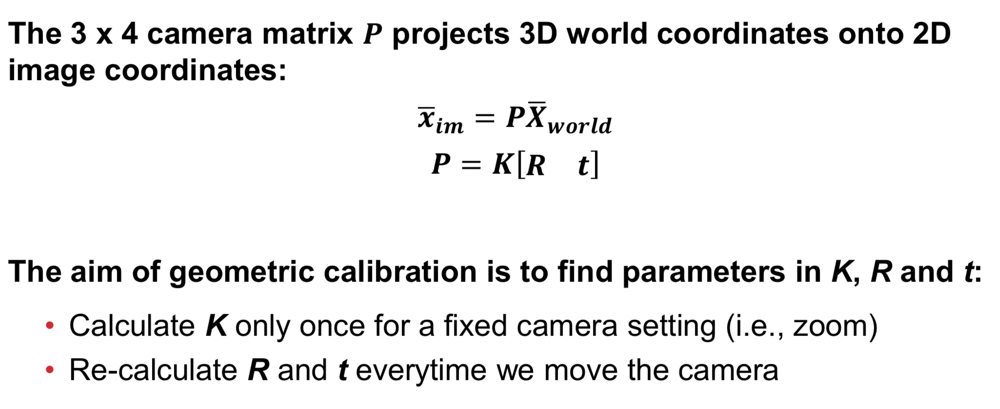

## Pinhole Camera Model

  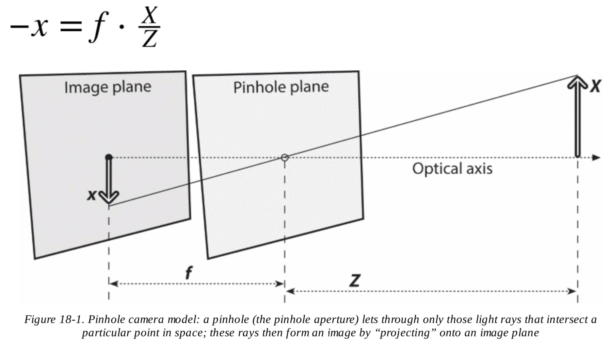

  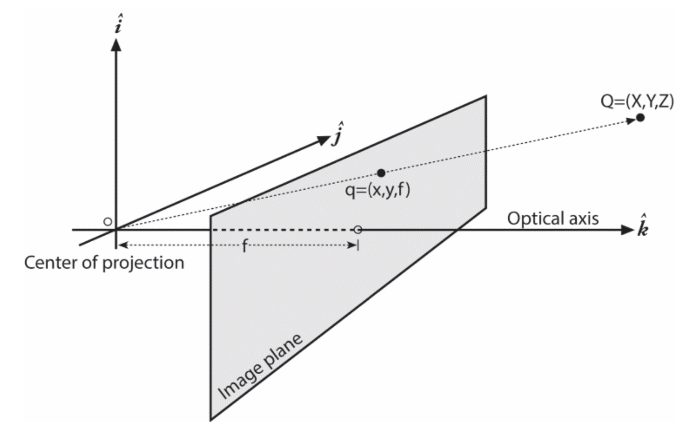

## Projective Geometry
* **Homogeneous coordinates**: (x, y, z) in a projective space of dimension 3 becomes (x, y, z, w)
* **Homogeneous coordinates**: two points whose values are **proportional** are **equivalent** points
* M = camera intrinsics matrix
  * cx and cy = displacement between **principal point** (intersection of the optical axis and the image plane) and **center of coordinates** on the projection screen
  * fx = F * sx and fy = F * sy
    * Two different focal lengths fx and fy, because the individual pixels on a typical low-cost imager are rectangular rather than square
    * F = physical focal length of the lens
    * sx and sy = the size of the individual imager elements, which is measured by **pixels per millimeter**

  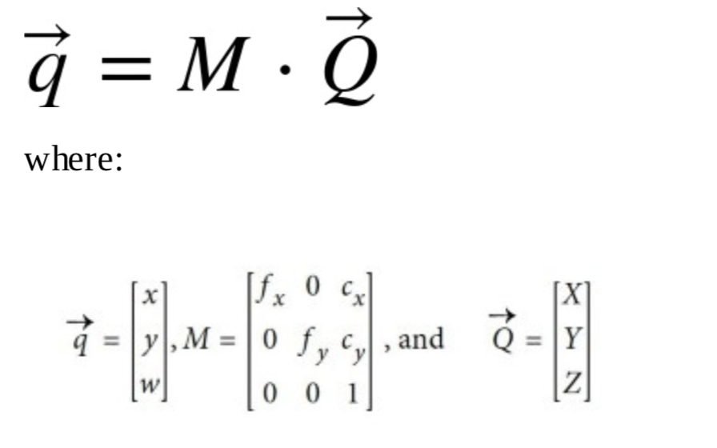

  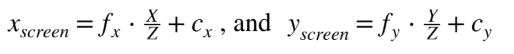

## Distortion
distortion coefficients = (k1, k2, p1, p2, k3)

### Radial Distortion

  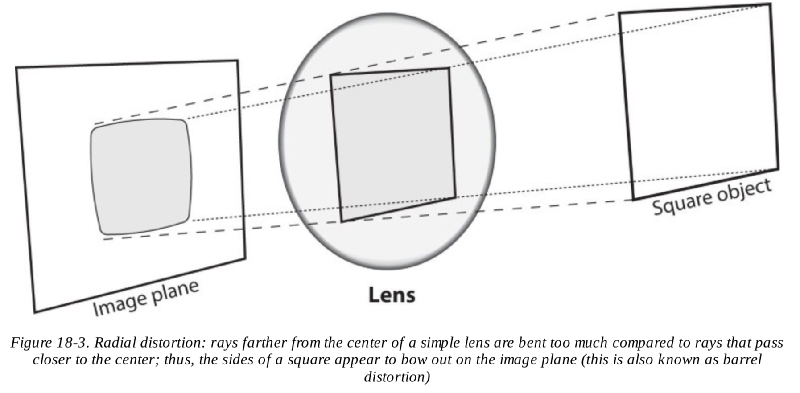

  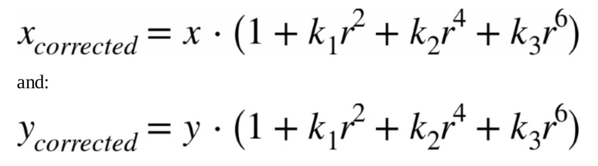

### Tangential Distortion

  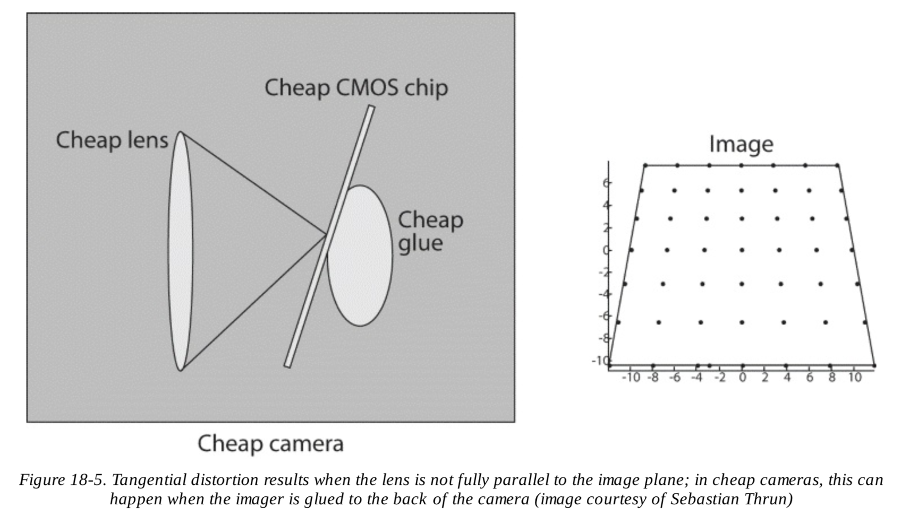

  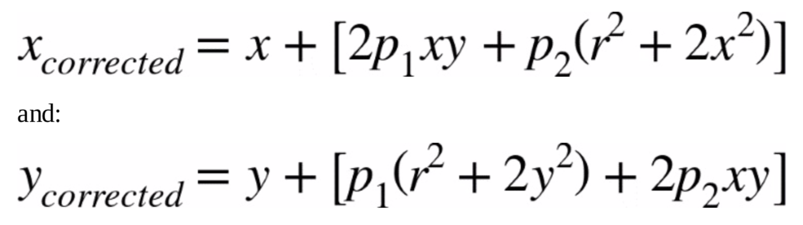

## Rodrigues Transform

  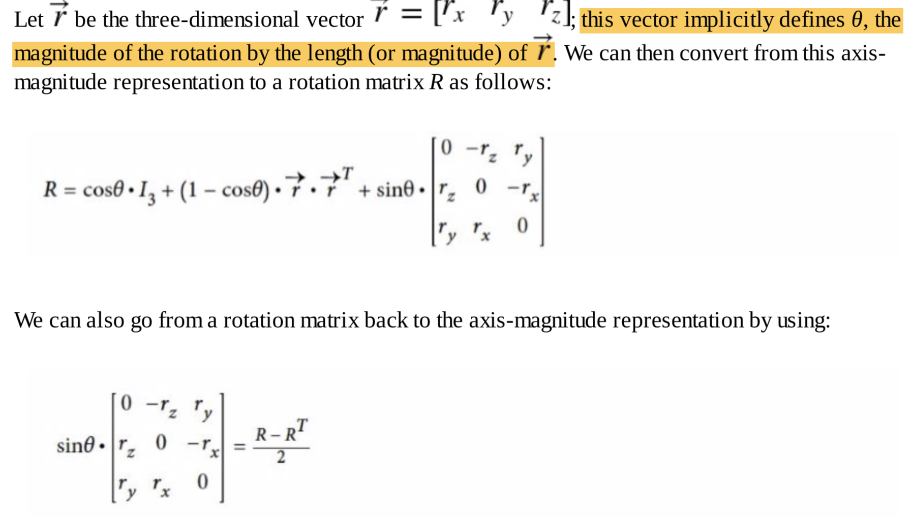

## Camera Coordinates and Object Coordinates
* R = **rotation matrix**
* T = **translation vector**

  

  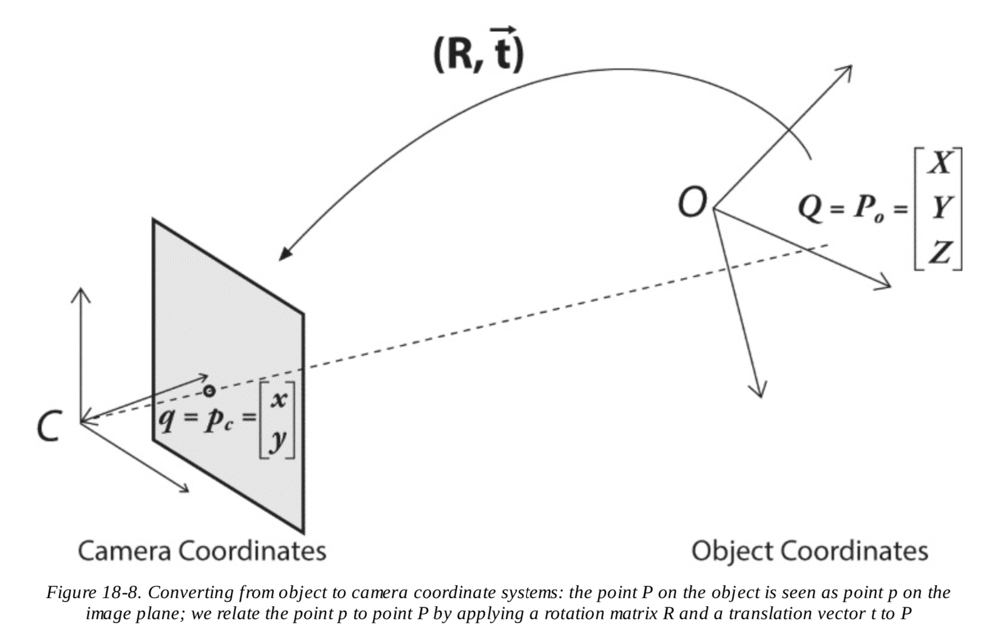

## Rotation
* rotate around x-, y-, and z-axes in sequence with respective rotation angles ψ, φ, and θ
* the total rotation matrix R = Rx(ψ) * Ry(φ) * Rz(θ)
* R * RT = RT * R = I3, where I3 is the 3x3 identity matrix
* R's **inverse** = R's **transpose**

  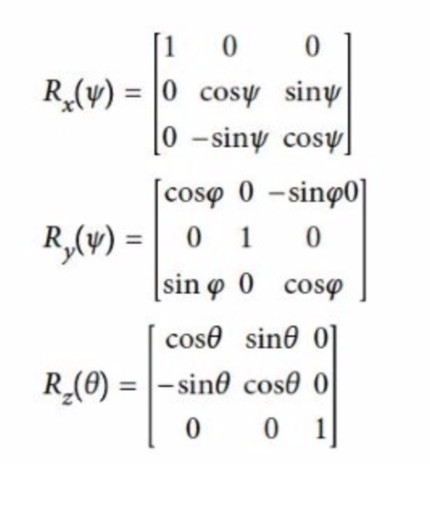

  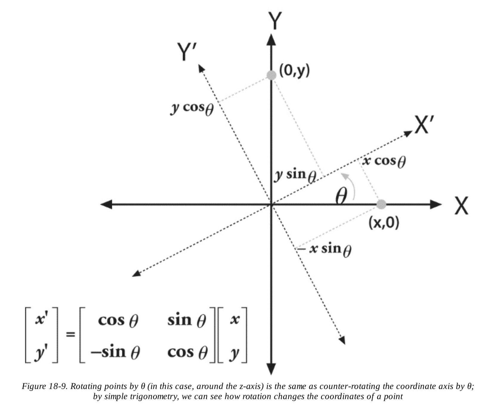

## Translation
* **translation vector** = originobject - origincamera

## References
* https://opencv.org/
* https://docs.opencv.org/2.4/doc/tutorials/calib3d/table_of_content_calib3d/table_of_content_calib3d.html
* https://michaelbach.de/ot/
* https://electronics.howstuffworks.com/camera.htm
* https://electronics.howstuffworks.com/cameras-photography/digital/digital-camera.htm
* https://en.wikipedia.org/wiki/Homogeneous_coordinates
* https://en.wikipedia.org/wiki/Camera_matrix
* https://micro.magnet.fsu.edu/primer/lightandcolor/index.html
* https://www.cs.cmu.edu/~german/research/RealTime/realtime.html
* http://www.cs.toronto.edu/~kyros/pubs/00.ijcv.carve.pdf
* https://people.csail.mit.edu/drdaniel/mesh_animation/
