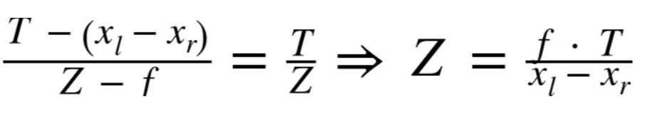

# Fundamentals

## Translation

  

## Rotation

  

  

## Extrinsic Parameters

  

  

## Intrinsic Parameters

  

  

  

## Extrinsic & Intrinsic Parameters

  

  

## Pinhole Camera Model

  

  

## Projective Geometry
* **Homogeneous coordinates**: (x, y, z) in a projective space of dimension 3 becomes (x, y, z, w)
* **Homogeneous coordinates**: two points whose values are **proportional** are **equivalent** points
* M = camera intrinsics matrix
  * cx and cy = displacement between **principal point** (intersection of the optical axis and the image plane) and **center of coordinates** on the projection screen
  * fx = F * sx and fy = F * sy
    * Two different focal lengths fx and fy, because the individual pixels on a typical low-cost imager are rectangular rather than square
    * F = physical focal length of the lens
    * sx and sy = the size of the individual imager elements, which is measured by **pixels per millimeter**

  

  

## Distortion
distortion coefficients = (k1, k2, p1, p2, k3)

### Radial Distortion

  

  

### Tangential Distortion

  

  

## Rodrigues Transform

  

## Camera Coordinates and Object Coordinates
* R = **rotation matrix**
* T = **translation vector**

  

  

## Rotation
* rotate around x-, y-, and z-axes in sequence with respective rotation angles ψ, φ, and θ
* the total rotation matrix R = Rx(ψ) * Ry(φ) * Rz(θ)
* R * RT = RT * R = I3, where I3 is the 3x3 identity matrix
* R's **inverse** = R's **transpose**

  

  

## Translation
* **translation vector** = originobject - origincamera

## Planar Homography

  

  

  

## Transform
* **affine transform**: rectangle -> parallelogram
* **perspective transform**: rectangle -> trapezoid

  

## Stereo Imaging (Two Cameras)
* **undistortion**: remove the radial and tangential lens distortion -> undistorted images
* **rectification**: adjust the angles and distances between cameras -> rectified and **row-aligned**: two image planes are coplanar & two image rows are collinear (**frontal parallel**)
* **correspondence**: find the same features in the left and right camera views -> **disparity map**: xl - xr
* **reprojection**: disparity map -> **triangulation** -> depth map

## Triangulation

  

  

  

  

## Epipolar Geometry

  

## Essential Matrix E and Fundamental Matrix F
* **essential matrix E** operates in physical coordinates
* **fundamental matrix F** operates in image pixel coordinates

  
  

  

## Stereo Rectification
**Hartley's algorithm**:
* cv::stereoRectifyUncalibrated() -> H1 and H2 (3x3 rectification/homography matrix)
* find **homographies** that map the **epipoles** to infinity
* minimize the computed **disparities** between the two stereo images

  

**Bouguet's algorithm**:
* cv::stereoCalibrate() -> cv::stereoRectify -> R1 and R2 (3x3 rectification/rotation matrix), P1 and P2 (3x4 projection matrix), Q (disparity to depth mapping matrix)
* minimize the amount of change **reprojection** produces for each of the two images
* maximize the common viewing area

**P**: 3x4 projection matrix (P1 and P2)

**Q**: 4x4 reprojection matrix (Q)

  
  

**cv::initUndistortRectifyMap()** -> map1 and map2 (undistort map) -> remap()
* it is called once for the left image and once for the right image from the stereo image pair

  

  

## Stereo Correspondence
**convert two images, one left and one right, into a single depth image**

**block matching (BM) algorithm**:
* prefiltering to **normalize** image brightness and enhance **texture**
* correspondence search along **horizontal epipolar lines** using a **SAD (Sum of Absolute Difference)** window
* postfiltering to eliminate bad correspondence matches

  

  

  

**disparity increment** -> **depth range resolution**

  

  

**semi-global block matching (SGBM) algorithm**: 
* precompute a C(x, y, d) per-pixel cost map that matches left_image(x, y) and right_image(x-d, y) using **Birchfield-Tomasi metrics**
* initialize the accumulator 3D cost map S(x, y, d) with 0
* for each of the 3-, 5-, or 8-direction (r), compute S(r)(x, y, d) using an iterative procedure
* add S(r)(x, y, d) for all r's to S(x, y, d)
* once S(x, y, d) is complete, we find d*(x, y) as argmin of S(x, y, d)
* we use the same **uniqueness check** and the same **subpixel interpolation** as in the StereoBM algorithm
* do the left-right check to make sure that left-to-right and right-to-left correspondences are consistent
* filter speckles using cv::filterSpeckles

  

  

## References
* https://opencv.org/
* https://docs.opencv.org/2.4/doc/tutorials/calib3d/table_of_content_calib3d/table_of_content_calib3d.html
* https://michaelbach.de/ot/
* https://electronics.howstuffworks.com/camera.htm
* https://electronics.howstuffworks.com/cameras-photography/digital/digital-camera.htm
* https://en.wikipedia.org/wiki/Homogeneous_coordinates
* https://en.wikipedia.org/wiki/Camera_matrix
* https://micro.magnet.fsu.edu/primer/lightandcolor/index.html
* https://www.cs.cmu.edu/~german/research/RealTime/realtime.html
* http://www.cs.toronto.edu/~kyros/pubs/00.ijcv.carve.pdf
* https://people.csail.mit.edu/drdaniel/mesh_animation/
