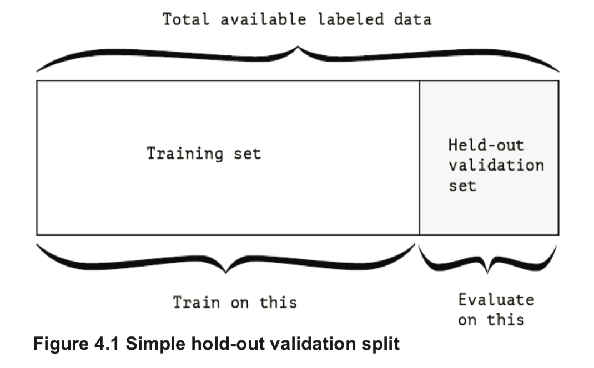
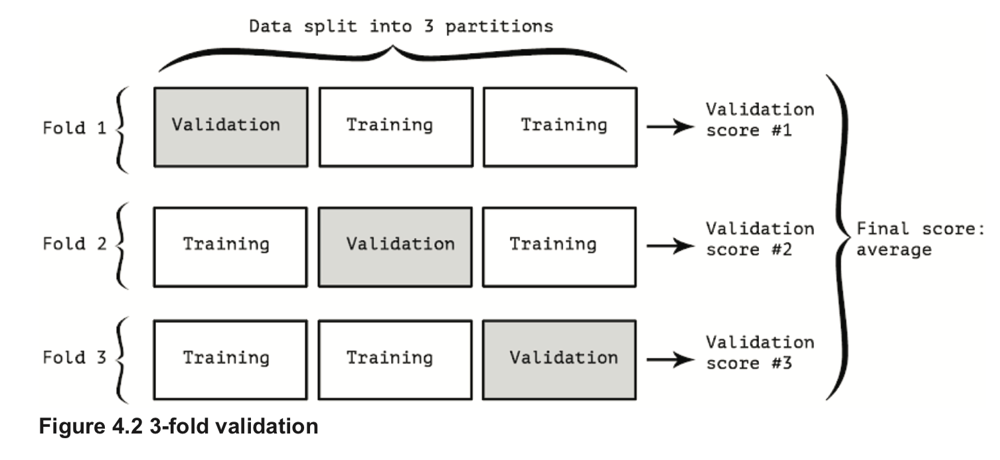

# Keras

## Validation

### Hold-out validation
<p float="left">
	
</p>

```
num_validation_samples = 10000

import numpy as np

# Shuffling the data is usually appropriate
np.random.shuffle(data)

# Define the validation set
validation_data = data[:num_validation_samples]
data = [num_validation_samples:]

# Define the training set
training_data = data[:]

# Train a model on the training data
# and evaluate it on the validation data
model = get_model()
model.train(training_data)
validation_score = model.evaluate(validation_data)

# Once you have tuned your hyperparameters,
# is it common to train your final model from scratch
# on all non-test data available.
model = get_model()
model.train(np.concatenate([training_data,
                            validation_data]))

test_score = model.evaluate(test_data)
```

### K-fold validation
<p float="left">
	
</p>

```
k= 4
num_validation_samples = len(data) // k

np.random.shuffle(data)
validation_scores = []

for fold in range(k):
    # Select the validation data partition
    validation_data = data[num_validation_samples * fold: num_validation_samples * (fold + 1)]

    # The remainder of the data is used as training data.
    # Note that the "+" operator below is list concatenation, not summation
    training_data = data[:num_validation_samples * fold] + data[num_validation_samples * (fold + 1):]

    # Create a brand new instance of our model (untrained)
    model = get_model()
    model.train(training_data)

    validation_score = model.evaluate(validation_data)
    validation_scores.append(validation_score)

# This is our validation score:
# the average of the validation scores of our k folds
validation_score = np.average(validation_scores)

# We train our final model on all non-test data available
model = get_model()
model.train(data)

test_score = model.evaluate(test_data)
```

## References
